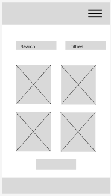
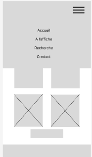

# Site Web GCR Cinéma

Ce README décrit le fonctionnement du site Web "GRC Cinéma" du point de vue du code, ainsi que l'organisation du projet.

## Fonctionnement du Site

### Lancement du projet

- **Live Preview** pour executer le site web veillez lancer l'extension `Live Preview` avec le boutton `Go Live` en ayant ouvert préalablement le dossier du projet dans VScode et dans index.html.

### Fichiers Principaux

- **index.html**: Le fichier HTML principal qui définit la structure de la page.
- **index.js**: Le fichier JavaScript qui contrôle le comportement interactif du site.
- **api.js**: Ce fichier gère l'appels à l'APi pour récupérer les données stockées.
- **contactPage.js**: Ce fichier contrôle les fonctionnalités et affichage dans la page "Contact" du site web.
- **landingPage**: Ce fichier contrôle les fonctionnalités et affichage dans la page "Accueil" du site web.
- **moviesPage**: Ce fichier contrôle les fonctionnalités et affichage dans la page "Films" du site web.
- **detailsPage** Ce fichier contrôle la fonctionnalités et l'affichage des détails d'un film quand on clique dessus dans la page "Films"
- **style.css**: Le fichier CSS qui gère le style et la mise en page du site.
- **contact.css**: Le fichier contact.css définit le style et la mise en page de contact (formulaire).

### Pages du Site

Le site comprend trois pages principales :

1. **Accueil (Landing Page)**: Présente une introduction au manga "The Promised Neverland" avec un bouton pour découvrir plus.
2. **Films**: Affiche tous les films disponibles prochainement au cinéma 
4. **Contact**: Permet aux utilisateurs de soumettre un formulaire de contact.

### Fonctionnalités Principales

- **Menu de Navigation**: Le menu de navigation permet de passer d'une page à l'autre de manière fluide.
- **Détails des films**: La page "Films" contient tous les films bientot disponible au cinéma et si on clique dessus cela affiche les détails de celui-ci.
- **Formulaire de Contact**: Sur la page de contact, les utilisateurs peuvent soumettre un formulaire pour contacter les administrateurs du GCR.

## Organisation du Projet

### Wireframe

Avant de commencer le développement, nous avons créé un wireframe avec Figma pour planifier la structure et le design du site. Voici quelques images du wireframe :

  

### Collaboration avec GitHub

Nous avons utilisé GitHub pour collaborer sur le projet à deux. Nous avons suivi les étapes suivantes :

1. Création d'un dépôt GitHub pour le projet.
2. Création d'un kanban dans github projet. 
3. Clonage du dépôt sur nos machines locales.
4. Création de issues pour chaque fonctionnalités. 
5. Création de branches automatiques depuis les issues pour travailler sur des fonctionnalités spécifiques.
6. Réalisation des modifications sur nos branches respectives.
7. Soumission de pull requests pour fusionner nos modifications dans la branche principale.
8. Révision et validation des pull requests avec l'autre collaborateur.
9. Fusion des pull requests une fois validées.

### Difficultés Rencontrées

Nous avons rencontré quelques difficultés lors du développement du site, notamment :

- **Menu Hamburger tout CSS**: La barre de navigation en html/css, récupérée d'un projet précédant, que nous avons eu du mal à adapter.
- **API** Gerer la consommation d’une API et son appel
  
Pour thibault: 
- Toute la partie JavaScript >>>>

  
Malgré ces défis, nous avons réussi à surmonter les obstacles et à livrer un site fonctionnel et esthétique.

AUDEBERT Jean-Charles et MESMIN Thibault
